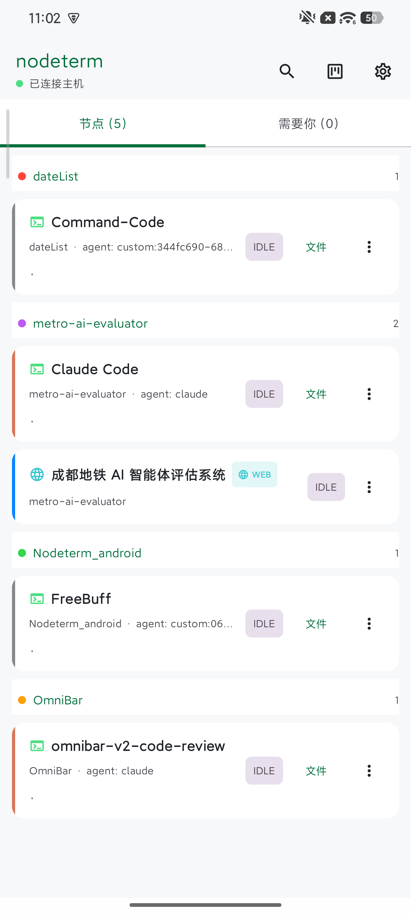

# nodeterm Android 伴侣客户端

[nodeterm](https://github.com/eneskirca/nodeterm)（基于节点的终端管理器）的原生 Android
（Kotlin + Jetpack Compose）伴侣客户端。通过二维码将手机与 nodeterm 主机配对，即可获得：
持久化的 E2EE 中继会话、带实时 agent 状态流（RUNNING / NEEDS YOU）的项目/节点列表、
**完整终端渲染**（VT 状态机、颜色、基于 tmux 的回滚）、对 NEEDS-YOU 请求的一键应答、
移动端看板视图、带 git status/diff 的只读远程文件浏览、Markdown 预览、语音输入、
**内置拼音软键盘**（免 IME 直输中文）、命令面板、节点滑动删除 / 拖拽排序，以及离线
Tailscale SSH 覆盖。在中继（Pro/有权限的主机）
之外，客户端同样支持 **LAN / SSH 直连传输** —— 与 iOS 客户端使用的免费层级路径相同，
无需中继、无需 Pro。

线协议按 nodeterm 参考源码（`src/main/remote/*`）逐字节实现；E2EE / 帧协议 / 中继状态机
单元测试通过与 TypeScript 实现本身生成的向量比对验证，VT 渲染器则由其自带的 ANSI 行为
测试套件验证。



## 模块

| 模块 | 类型 | 内容 |
|--------|------|----------|
| `:core` | 纯 Kotlin/JVM，**不依赖 Android** | NaCl box E2EE + HKDF-SHA256、16 字节终端帧协议、RPC 信封 + 中继状态机（可注入传输层）、配对 offer / workspace / canvas / agent-status 镜像 / inbox 模型（含每个节点的 "now" 活动 + 上下文计量条）、**VT100/xterm 终端模拟器**（屏幕 + 解析器 + 回滚 + 备用屏幕）、**git status 模型 + 逐行语法高亮器**、**轻量级 Markdown 渲染器**、**LAN 命令构建器 + 解析器**（tmux/ssh-fs 线格式、v3→v2 workspace 组装） |
| `:app` | Android 应用 | OkHttp WebSocket 传输、**sshj LAN/SSH 传输**（ed25519 认证、TOFU 主机密钥固定、tmux PTY 终端连接）、基于 Keystore 的会话持久化（中继 + LAN 凭据）、Compose UI（配对/SAS/首页/节点/**完整终端渲染器 + 语音输入**/收件箱/**看板**/**文件浏览器 + 语法高亮查看器 + Markdown 视图 + git status/diff**/**⌘K 命令面板**/设置）、FCM 消息服务 + 本地通知、**UI 偏好存储**（滑动隐藏的节点、已忽略的 needs-you 事件、自定义的每项目节点顺序）、生命周期感知的状态轮询（省电） |

## 构建

前置要求：

- **JDK 17+**（已在 OpenJDK 21 上验证）。
- **Android SDK**，含 `platforms;android-35` 和 `build-tools`（AGP 8.10）。设置 `ANDROID_HOME`
  或在 `local.properties` 中创建 `sdk.dir=…`。

命令：

```bash
# 纯协议层单元测试——只需 JDK：
./gradlew :core:test

# 纯 JVM 应用测试（节点列表排序 / 滑动删除逻辑，以及可选的 LanE2eTest）：
./gradlew :app:testDebugUnitTest

# 完整应用：
./gradlew :app:assembleDebug
```

## FCM（主机推送入口）

应用在**没有** Firebase 项目的情况下也能正常构建和运行。`NodetermMessagingService`
（`notify/NodetermMessagingService.kt`）是主机推送的入口点：它为主机推送的 RUNNING /
NEEDS YOU / done 事件渲染本地通知。

如需启用真实推送：

1. 创建一个 Firebase 项目并添加 Android 应用（`com.nodeterm.android`）。
2. 将 `google-services.json` 下载到 `app/` 目录。
3. 在根目录的 `build.gradle.kts` 中添加：
   ```kotlin
   plugins { id("com.google.gms.google-services") version "4.4.2" apply false }
   ```
   并在 `app/build.gradle.kts` 中添加：
   ```kotlin
   plugins { id("com.google.gms.google-services") }
   ```
4. 重新构建。`NodetermMessagingService.onNewToken` 会持久化注册令牌，用于主机的推送授权模型。

## 配对流程

1. 主机端：设置 → Phone → 显示配对码（`nodeterm://pair?code=…` 二维码）。
2. Android 端：扫码（或粘贴配对码）。offer 会被校验（仅允许 wss、允许 loopback-ws、
   必须包含 token + 主机公钥）——与参考 `pairing.ts` 保持一致。
3. 客户端会生成自己的 NaCl box 密钥对（私钥通过 Android Keystore 加密存储），连接
   `wss://<relay>/?token=…`，并执行 E2EE 握手：
   `e2ee_hello → e2ee_ready → e2ee_auth → e2ee_authenticated`（控制消息用明文文本帧，
   之后为 E2EE 二进制 box——带角色标签、序号防护）。
4. 双方人工比对 6 位 SAS 码；主机一次性批准 pin；客户端同步 `projects.list`
   （workspace + tmux 会话 + agent-status 镜像）和 canvas 镜像。
5. 终端节点以 RAW PTY 字节流形式输出（Snapshot*/Output/Error 帧）；`:core` 的 VT 模拟器
   渲染它们（SGR 颜色、粗体/斜体/下划线、光标、备用屏幕），键入的输入以 OP.Input 帧发回。
   NEEDS YOU 审批通过主机的 `agent:answer-permission` RPC（hook-reply 票据）应答，
   并提供 send-keys 兜底——即参考实现文档描述的 v1 行为。

## LAN / SSH 直连传输（免费层级）

当 v0.2.37 主机的 QR 载荷**不含中继块**时（免费层级——“从手机远程访问”关闭，无 Pro），
应用会回退到 LAN / SSH 直连通道而不是报错——这正是 iOS 客户端浏览所用的路径。
**即使主机确实生成了中继 token**（v0.2.37 的配对服务器总是会生成），免费层级的主机也
永远不会真正加入中继房间，因此中继握手会超时，应用随后**自动回退到同一 LAN / SSH 通道**
（一次性提示，然后 READY——不会出现死掉的 "Disconnected" 界面）。一旦 LAN 会话可用，
偏好会被持久化，之后的恢复会完全跳过注定失败的中继尝试，直接走 LAN。

1. 配对（`POST http://<host>:<pairPort>/pair`）在主机端无需门禁，且总会将我们的 ed25519
   密钥安装到 `~/.ssh/authorized_keys`；客户端**持久化该密钥对**（加密存储）作为其 LAN
   凭据（即使同时提供了中继路径，这样中继握手失败时可以回退到它）。
2. 直接以 `user` 身份 SSH 连接到 `host:22`（sshj + EdDSA），并固定主机密钥
   （TOFU：首次连接接受，之后变更拒绝）。
3. 项目/状态来自中继所服务的相同字节：探测主机 userData 目录、读取
   `workspace.json` + `agent-status.json`、列出存活的 `nt-<nodeId>` tmux 会话，
   将 v3 索引 + 项目文件组装成 UI 渲染所需的 v2 workspace。
4. 节点的终端是一个 tmux **客户端**（`tmux -L node-terminal new-session -A -s nt-<id>`），
   运行在 PTY 之下并使用 capture-pane 快照；输入/缩放/SGR 滚轮滚动直接写入其中。
   文件浏览、git status/diff 和 NEEDS-YOU 应答（send-keys）都是只读的一次性 exec。

**真实端到端检查**（针对本机自带的 sshd + tmux + 真实桌面 userData）——可选的集成测试，
它会安装一次性 ed25519 密钥，运行完整的 LAN 命令链（探测 → 元数据 → workspace 组装 →
tmux PTY 连接 + 键入往返 → 捕获 → 滚动 → fs/git），然后恢复一切：

```bash
NODETERM_E2E=1 ./gradlew :app:testDebugUnitTest --tests '*LanE2eTest'
```

**macOS 注意事项（TCC）：** `sshd` launchd 守护进程通常缺少完全磁盘访问权限，因此
`~/Documents` 等目录下的项目文件通过 SSH 会返回 `Operation not permitted`——此时 LAN 传输
会显示空项目列表并给出一次性提示（中继路径不受影响，因为有权访问文件的主机端应用会读取
它们）。在 系统设置 → 隐私与安全 中授予 `sshd-keygen-wrapper` 完全磁盘访问权限，
或将项目放在 TCC 保护的文件夹之外。非交互式 SSH exec 也缺少 Homebrew PATH，
因此命令会加上 PATH 增强前缀（`/opt/homebrew/bin` 等）。

**Android 注意事项（BouncyCastle）：** Android 自带的是一份**极其古老**的 BouncyCastle 分支，
提供商名为 `"BC"`，而 sshj 会复用已有的 `"BC"` 提供商而不是注册自带的 bcprov——
因此在真机上 curve25519 KEX 会以 `no such algorithm: X25519 for provider BC` 失败
（JVM 单元测试永远不会触发）。`LanSessionManager` 现在会在任何 sshj 加密之前用自带的
bcprov 1.78+ 替换平台提供商，并提供自适应 KEX 列表（X25519 可用时用 curve25519，
否则用 ECDH-NIST P-256/384/521——macOS sshd 两者都支持）。

**通过 Tailscale 离线访问（SSH 主机覆盖）：** 直连传输的主机地址来自配对二维码（通常是
局域网 IP），所以手机一离开 Wi-Fi 就会失效。设置 → **Direct connection (SSH)** 允许你将
持久化的会话指向不同地址——例如主机的 **Tailscale IP**（`100.x.y.z`）——并使用**相同的
已保存 ed25519 密钥和 TOFU 指纹**重新连接（无需重新配对，同一台机器只是换了个地址）。
如果新地址始终无法到达 READY（地址输错，或 Tailscale 未启动），会自动恢复之前可用的主机，
应用会保留最后一次良好的会话而不是清空它。

## 功能

### 终端与远程会话

- **完整终端渲染** — `core/…/vt/` 实现了 xterm 状态机（UTF-8、CSI/OSC/DCS、SGR
  16/256/真彩色、光标寻址、擦除、滚动区域、备用屏幕、转录）。应用的 `TerminalRenderer`
  在 Compose Canvas 上绘制单元格网格，支持逐次运行的配色和块状光标；视图会自动调整远程
  pty 的尺寸（`OP.Resize`）。
- **基于 tmux 的回滚** — 主机 tmux 会话拥有历史记录：手机发送 `pty.scroll`
  （`{streamId, dir, lines}`），重绘的屏幕以 Output 帧流式传回（SGR 滚轮事件 → tmux
  滚动模式）。模拟器的本地转录有存储/测试，但不是 tmux 节点的回滚事实来源。
- **快照** — `tmux capture-pane -e` 的转储以 Snapshot* 帧到达；客户端重置屏幕并重放它们
  （`\n` → `\r\n`，让捕获行从第 0 列开始；实时 pty 输出已通过 ONLCR 以 `\r\n` 到达）。
- **语音输入** — 终端输入栏的麦克风按钮使用 Android `SpeechRecognizer`
  （RECORD_AUDIO 运行时授权；未安装语音服务时优雅降级，例如模拟器）：实时部分结果先落入
  输入框，然后发送。
- **内置拼音键盘** — 终端输入不再依赖系统 IME：`BuiltInKeyboard` 软键盘接管输入，系统键盘
  不会弹出。默认只读隐藏（不遮挡终端输出），点按终端唤起、发送后自动收起，返回键先收起
  键盘再离开。输入累积在屏上输入行，回车以 CR 发送（raw-mode TUI 如 Claude Code 用 CR 作为
  提交信号）；**中** 模式基于内置 CC-CEDICT 词典做拼音组字，候选条即点即上屏，英文/符号
  键随时直通。
- **订阅清理** — 关闭终端（或切换节点）会发送 `pty.kill {streamId}`，让主机丢弃分离的
  pty 并停止流式传输；不再泄漏流。

### 看板、文件与 git

- **移动看板** — `canvas:request`/`canvas:state` 节点渲染在可平移/缩放的表面上，带有 canvas
  颜色、标题和实时状态徽标；点击节点即可打开其终端。
- **节点类型视觉语言** — 每种节点类型（terminal、agent、note、group、editor、diff、web、
  video）在首页列表、看板、看板列中处处携带桌面的图标 + 强调色，由单一事实来源
  （`ui/NodeKind.kt`）驱动；看板卡片按类型渲染：便签、组容器、带类型字形的 editor/diff/web
  卡片。
- **只读远程文件浏览** — `fs.list` / `fs.read` / `fs.readBinary`（限制在主机的共享项目根目录
  内）驱动目录遍历器和只读文本查看器（二进制显示十六进制预览）。SSH/远程项目通过主机的
  自有层解析。
- **语法高亮编辑器视图** — 文件查看器显示**行号 + 语法高亮**（`:core` 中的逐行分词器，
  支持 Kotlin/Java/TS/Python/Go/Rust/Shell/Swift/C/JSON/YAML/SQL/Markdown，语言根据扩展名
  自动检测），并有超大文件渲染上限。
- **只读 git** — 从文件浏览器进入：`git.status`（分支、领先/落后、staged + 带状态字母的
  changed 列表）和 `git.diff`（带 +/-/元信息配色的统一 diff），全部只读。
- **Markdown 预览** — 文件浏览器中的 `.md` / `README` 文件通过一个零依赖的轻量渲染器
  （`:core/text/Markdown.kt`，移动端 ⌘M 镜像）渲染，而不是原始代码视图：标题、列表、引用、
  围栏代码、行内粗体/斜体/链接——纯数据进，Compose 样式出。

### 首页与收件箱

- **命令面板（⌘K）** — 可通过滑动/键盘打开的浮层，可跳转到任何地方：打开任意终端/agent
  节点、浏览项目的文件，或执行应用操作（看板 / 设置 / 重新配对）。输入过滤，Enter 或点击
  激活，Esc 关闭——在触屏上保留桌面端肌肉记忆。
- **每节点 "now" 计量** — 主机镜像的每节点活动行（"Running npm test"）和上下文窗口填充
  显示在节点卡片和看板上；收件箱形状解析同时容忍当前主机对象形状和旧版裸数组形状，
  因此形状不匹配永远不会丢掉任何徽标。
- **滑动删除节点（带撤销）** — 在节点列表中横向滑动节点以**本地**隐藏它（它在主机上继续
  运行，也保留在看板上），并带一键**撤销**提示条。隐藏的节点在重新配对和应用重启后仍然
  保留（`UiPrefsStore`，一个与会话存储分开的偏好文件，因此取消配对不会重置它们）。
- **长按拖拽排序** — 在项目分组内拖拽节点以设置自定义顺序；主机的状态排序（needs-you →
  working → done → idle，然后是标题）仍是未手动排序节点以及无自定义顺序项目的兜底方案。
  纯列表逻辑位于 `ui/NodeListOrder.kt`，并有单元测试（`NodeListOrderTest`）。
- **忽略 Needs-you 卡片** — 滑动单个卡片，或在 Needs-you 标签页上点 **Clear all**（同时
  取消这些事件已发布的通知）；忽略状态在多次轮询之间持久保留。
- **下拉刷新 + 生命周期感知轮询** — 在首页列表上下拉可立即轮询主机；应用进入后台时后台
  轮询暂停（省电），回到前台时立即刷新恢复。
- **通知深链** — 点击 NEEDS-YOU 推送会直接打开该节点的终端（一旦其行已同步；冷启动也能
  工作，并且仍能打开已滑动隐藏的节点）。

## 安全模型

- 所有中继流量均为 E2EE（NaCl box，按角色/序号防护），并有一次性的 SAS 校验；
  LAN 传输使用 ed25519 认证 + TOFU 主机密钥固定。
- 会话凭据（中继 + LAN 密钥对）通过 Android Keystore 加密存储。
- 文件浏览器、git 和 NEEDS-YOU 应答按设计只读；不向手机暴露任何编辑或变更端点
  （`fs.write`、`git.stage`/commit/push、canvas 编辑）。
